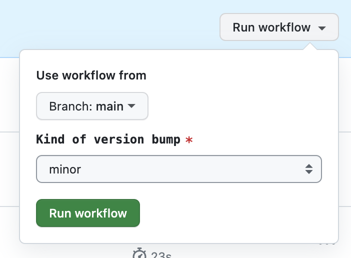

# Contributing

## Pre-requisites

This repo using git hooks to ensure that the code is committed in a good state.
To install the hooks, run the following command:

```bash
git config core.hooksPath .githooks
```

Ensure the following are installed:

- [Deno](https://docs.deno.com/runtime/manual/getting_started/installation) (we
  will eventually move to this dependency)
- [Node.js](https://nodejs.org/en/download)

## Set-up and testing

To get started, clone the repo and install the dependencies:

```bash
npm install
```

Then run the formatting, linting and tests:

```bash
npm run pre-commit
```

### Development

It is useful to run the following in watch mode while developing

### Compiling

```bash
npm run watch
```

### Testing

```bash
npm run test:watch
```

## Release Process

To release a new version, take the following steps:

- Bump the version by running the
  [`version_bump`](https://github.com/nifty-lil-tricks/monitoring/actions/workflows/version_bump.yml)
  GitHub Action and choose the appropriate version bump:



- Wait for the Pull Request to be created and merge this into main.

- Wait for the
  [`main` branch action](https://github.com/nifty-lil-tricks/monitoring/actions?query=branch%3Amain)
  to complete.

- Find the created
  [draft release](https://github.com/nifty-lil-tricks/monitoring/releases) and
  publish it.
